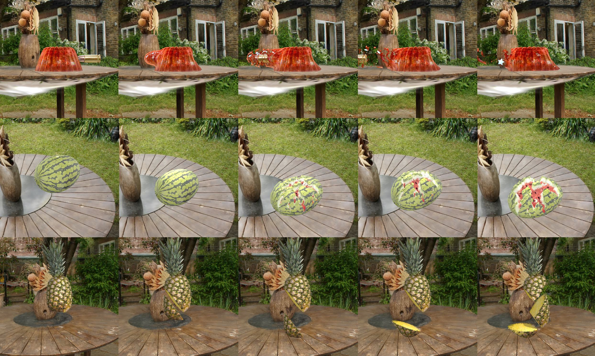

# GaussianFluent: Gaussian Simulation for Dynamic Scenes with Mixed Materials

### [[arXiv](https://arxiv.org/abs/2601.09265)] [CVPR 2026 Award Candidate]
### [[Project Page](https://hb-pencil-zero.github.io/GaussianFluent/)]

Bei Huang<sup>1,2*</sup>, Yixin Chen<sup>2*&dagger;</sup>, Ruijie Lu<sup>1,2</sup>, Gang Zeng<sup>1</sup>, Hongbin Zha<sup>1</sup>, Yuru Pei<sup>1&dagger;</sup>, Siyuan Huang<sup>2&dagger;</sup><br>
<sup>*</sup> Equal contribution, <sup>&dagger;</sup> Corresponding authors<br>
<sup>1</sup>State Key Laboratory of General Artificial Intelligence, Peking University<br>
<sup>2</sup>State Key Laboratory of General Artificial Intelligence, BIGAI<br>



Abstract: *3D Gaussian Splatting (3DGS) has emerged as a prominent 3D representation for high-fidelity and real-time rendering. Prior work has coupled physics simulation with Gaussians, but predominantly targets soft, deformable materials, leaving brittle fracture largely unresolved. This stems from two key obstacles: the lack of volumetric interiors with coherent textures in GS representation, and the absence of fracture-aware simulation methods for Gaussians. To address these challenges, we introduce GaussianFluent, a unified framework for realistic simulation and rendering of dynamic object states. First, it synthesizes photorealistic interiors by densifying internal Gaussians guided by generative models. Second, it integrates an optimized Continuum Damage Material Point Method (CD-MPM) to enable brittle fracture simulation at remarkably high speed. Our approach handles complex scenarios including mixed-material objects and multi-stage fracture propagation, achieving results infeasible with previous methods. Experiments clearly demonstrate GaussianFluent's capability for photo-realistic, real-time rendering with structurally consistent interiors, highlighting its potential for downstream application, such as VR and Robotics.*

## News
- [2026-01-14] Our paper GaussianFluent has been accepted by CVPR 2026 as an Award Candidate!
- [2026-04-01] Simulation Code Release.

## Cloning the Repository
This repository uses a modified [gaussian-splatting](https://github.com/HB-pencil-zero/gaussian-splatting) as a submodule. Use the following command to clone:

```shell
git clone --recurse-submodules git@github.com:HB-pencil-zero/GaussianFluent.git
```

The interior texture back-projection code requires this modified submodule,
because its rasterizer returns per-Gaussian screen coordinates as `point_xy`.
Use `HB-pencil-zero/gaussian-splatting` commit `11b81b5` or newer.

## Setup

### Python Environment
To prepare the Python environment needed to run GaussianFluent, execute the following commands:
```shell
conda create -n GaussianFluent python=3.9
conda activate GaussianFluent

pip install -r requirements.txt
pip install -e gaussian-splatting/submodules/diff-gaussian-rasterization/
pip install -e gaussian-splatting/submodules/simple-knn/
```
By default, We use pytorch=2.0.1+cu117.

### Quick Start
1. **Download Pretrained 3DGS Assets**:
   Download the released Gaussian Splatting assets and configs from our
   [Hugging Face Repository](https://huggingface.co/hbpencil01/GaussianFluent/tree/main).
   The release includes 22 3DGS asset directories and 32 simulation config
   files from the research codebase; the commands below use `watermelon` and
   `jelly` as quick-start examples.

   Place the downloaded `model/` and `config/` folders into the root directory
   of this project:
   ```shell
   # The structure should look like:
   # ./model/watermelon/...
   # ./model/jelly/...
   # ./model/garden/...
   # ./model/trained_gs_fruitninja/...
   # ./config/watermelon_config.json
   # ./config/jelly_config_nacc.json
   ```

2. **Run Simulation**:
   We provide corresponding `.json` config files in the `config` directory. Run the following commands to simulate:
   ```shell
   # For watermelon simulation
   python gs_simulation/watermelon/gs_simulation_watermelon.py --model_path model/watermelon --output_path output/watermelon --config config/watermelon_config.json --render_img --compile_video

   # For jelly simulation
   python gs_simulation/jelly/gs_simulation_jellynacc.py --model_path model/jelly --output_path output/jelly --config config/jelly_config_nacc.json --render_img --compile_video
   ```
   The images and video results will be saved to the specified output path.

## Interior Filling

The reusable interior geometry filling code is organized under
[`interior_filling/`](interior_filling/README.md). It provides a standalone
command for generating filled internal particles from a trained 3DGS checkpoint,
plus a pipeline wrapper for preparing external inpainting inputs and applying
saved `point_xy` back-projection results.

Interior texture inpainting can use the third-party
[MVInpainter](https://github.com/ewrfcas/MVInpainter) project. MVInpainter is
not part of this repository and is not redistributed with the GaussianFluent
code or model assets.

## Citation

```
@article{huang2026gaussianfluent,
      title={GaussianFluent: Gaussian Simulation for Dynamic Scenes with Mixed Materials},
      author={Huang, Bei and Chen, Yixin and Lu, Ruijie and Zeng, Gang and Zha, Hongbin and Pei, Yuru and Huang, Siyuan},
      journal={arXiv preprint arXiv:2601.09265},
      year={2026},
}

@article{wolper2019cd,
  title={CD-MPM: Continuum damage material point methods for dynamic fracture animation},
  author={Wolper, Joshuah and Fang, Yu and Li, Minchen and Lu, Jiecong and Gao, Ming and Jiang, Chenfanfu},
  journal={ACM Transactions on Graphics (TOG)},
  volume={38},
  number={4},
  pages={119},
  year={2019},
  publisher={ACM}
}
```

## Acknowledgement
This codebase is built upon [PhysGaussian](https://github.com/XPandora/PhysGaussian). The CD-MPM implementation is inspired by the reference code of [ziran2019](https://github.com/penn-graphics-research/ziran2019). We thank the authors for their excellent work.
